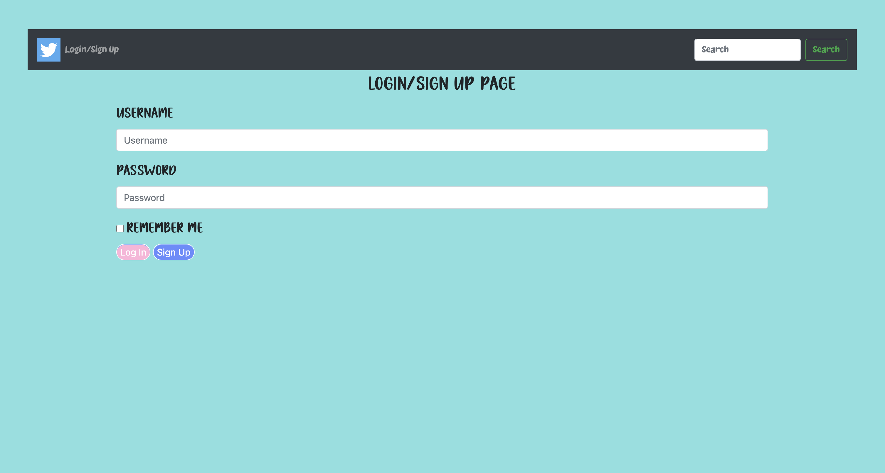
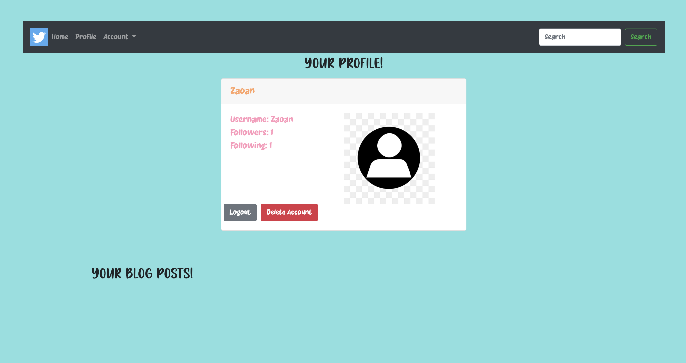
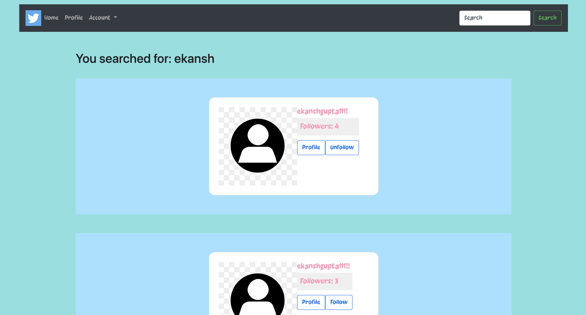
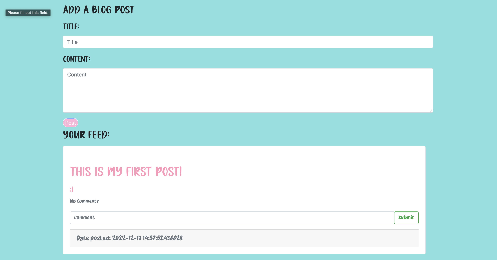

# Fake Twitter

Contributors:
- Ekansh Gupta (@ekanshgupta123)
- Navdip Dosanjh (@DosanjhNavdip)
- Joshua Mack (@Baygulll)
- Haomiao Wang (@hmw17)

  Team Lead: Ekansh Gupta

## Table of contents
* [General info](#general-info)
* [Technologies](#technologies)
* [Setup](#setup)

## General info
In this project, we created a website that allows users to follow other users. Users will be able to make posts that their followers can see and reply to their following's posts. 

## Technologies
* Python 3.10.6
* Flask 2.2.2
* sqlalchemy 1.4.41
* flask-login 0.7.0
* flask-wtf 1.01

## Setup
- To run this project, install it locally and run app.py 
- From there you will be directed to the login/sign up page 
- You will be able to sign up an account. Next, login to view your profile and home page.
- You will be able to make a post from the home page and can see it on your profile and in your feed! 
- You will be able to search up for other users and be able to follow them, if you created other accounts locally. 
- If you follow them, you will be able to see your and your following's posts on your home page and be able to comment on them! 

